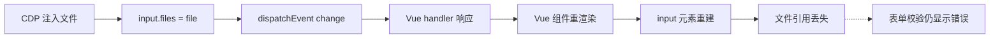

# CDP 文件注入技术（2026-06-15 探索记录）

## 背景

店小秘商品说明书上传使用 Vue 3 + Ant Design Vue 自定义 `manual-upload` 组件。
标准的文件上传自动化方法均告失败。

## 已尝试的方法对比

| 方法 | 代码位置 | 文件写入 | 表单校验 | 结论 |
|:--|:--|:--:|:--:|:--|
| DOM.setFileInputFiles + backendNodeId | browser_cdp | ❌ 静默失败 | — | CDP 对 user-agent shadow input 无效 |
| JS DataTransfer + Event('change') | browser_cdp | ✅ 临时 | ❌ Vue 重渲染清除 | 文件在，但表单不认 |
| WebSocket + atob + File() 构造 | Python websockets | ✅ 132KB完整 | ❌ Vue 重渲染清除 | 最完整的注入方式 |
| Playwright `.click()` + dropdown | Playwright | ❌ 文件选择器不触发 | — | Ant Design 事件系统不响应 |
| Playwright `expect_file_chooser()` | Playwright | ✅ 文件选择器打开 | ❌ files.length=0 | CDP 写入后 Vue 清除 |

## 核心限制



**根本原因：** Vue 3 的响应式系统在组件状态更新后重建 DOM。`<input type="file">` 的 `files` 是 DOM 实例属性，不是 Vue 响应式数据。重建后新 input 的 `files` 为空。

## 参考：WebSocket 文件注入方法

这是唯一能将真实文件内容（132KB PDF）写入 input 的方法：

```python
import json, asyncio
import websockets

CDP_WS = 'ws://127.0.0.1:19223/devtools/browser/<BROWSER_ID>'
TARGET_ID = '<PAGE_TARGET_ID>'

with open('/tmp/pdf_b64.txt') as f:
    b64 = f.read()

async def main():
    async with websockets.connect(CDP_WS, max_size=10*1024*1024, ping_interval=None) as ws:
        # 1. Attach to target
        await ws.send(json.dumps({"id": 1, "method": "Target.attachToTarget",
            "params": {"targetId": TARGET_ID, "flatten": True}}))
        resp = json.loads(await ws.recv())
        session_id = resp.get('params',{}).get('sessionId') or resp.get('result',{}).get('sessionId')
        
        # 2. Wait for attachedToTarget event
        while not session_id:
            resp = json.loads(await ws.recv())
            if resp.get('method') == 'Target.attachedToTarget':
                session_id = resp['params']['sessionId']
        
        # 3. Inject file via Runtime.evaluate
        js = f'''(async function() {{
            var b64 = "{b64}";
            var binaryStr = atob(b64);
            var bytes = new Uint8Array(binaryStr.length);
            for (var i = 0; i < binaryStr.length; i++) {{
                bytes[i] = binaryStr.charCodeAt(i);
            }}
            var file = new File([bytes], '风扇说明书.pdf', {{type: 'application/pdf'}});
            var input = document.querySelector('#localFileUploadInp');
            var dt = new DataTransfer();
            dt.items.add(file);
            input.files = dt.files;
            ['change', 'input', 'blur'].forEach(function(n) {{
                input.dispatchEvent(new Event(n, {{bubbles: true}}));
            }});
            return JSON.stringify({{ok: true, size: file.size, files: input.files.length}});
        }})()'''
        
        await ws.send(json.dumps({
            "id": 2, "sessionId": session_id,
            "method": "Runtime.evaluate",
            "params": {"expression": js, "returnByValue": True, "awaitPromise": True, "timeout": 120000}
        }))
        
        resp = json.loads(await ws.recv())
        print(resp.get('result',{}).get('result',{}).get('value','FAIL'))

asyncio.run(main())
```

⚠️ 此方法 100% 可以注入完整文件，但表单校验仍然不通过。仅供探索参考。

---

*作者: Rigi AI Commons | 小红书 @瑞吉AI人民公社 | AI自动化专家工作流*